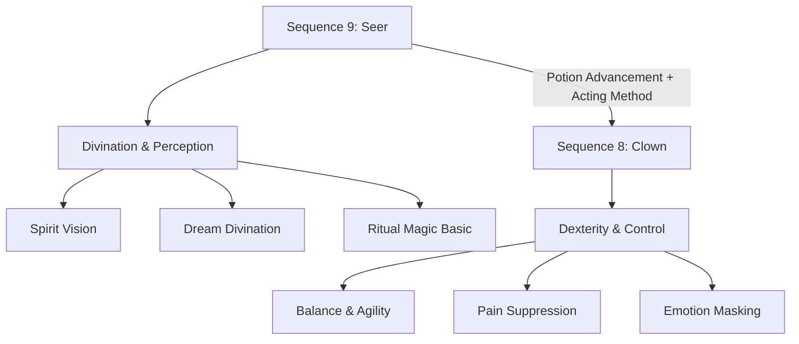

# Klein — Sequences 9 → 8 (Minimal Test)

```mermaid
flowchart TD
  A9[Sequence 9: Seer] -->|Potion Advancement + Acting Method| A8[Sequence 8: Clown]

  A9 --> B1[Divination & Perception]
  B1 --> B2[Spirit Vision]
  B1 --> B3[Dream Divination]
  B1 --> B4[Ritual Magic Basic]

  A8 --> C1[Dexterity & Control]
  C1 --> C2[Balance & Agility]
  C1 --> C3[Pain Suppression]
  C1 --> C4[Emotion Masking]
```
