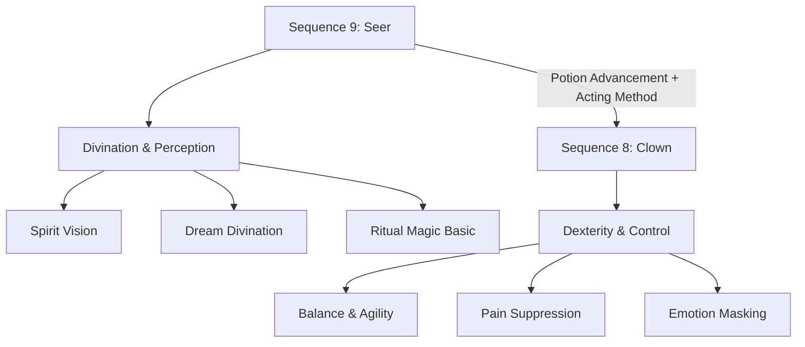

# 🌌 Lord of the Mysteries — Klein’s Sequences (9 → 8)

This README uses **Mermaid** diagrams and tables. If the diagram below renders, you’re good to go.

---

## ⚙️ Pathway Progression (Stable Flowchart)

---

## 🪄 Sequence 9 — **Seer**
| Capability | What it does | Notes |
|---|---|---|
| Spiritual Intuition | Gut feeling of danger. | Vague but life-saving. |
| Dream Divination | Interpret dreams; tarot/pendulum/coins. | Symbolic; requires insight. |
| Spirit Vision | See auras, curses, spirits. | Uses focus. |
| Ritual Magic (Basic) | Simple ceremonies/talismans. | Prep/knowledge dependent. |
| Minor Luck Nudges | Slight outcome shifts. | Unreliable. |

**Trade-offs:** fragile; divination can mislead; mental strain; weak in direct combat.

---

## 🎭 Sequence 8 — **Clown**
| Capability | What it does | Notes |
|---|---|---|
| Balance & Agility | Acrobatics; better evasion. | Circus-like feats. |
| Pain Suppression | Fight through wounds. | Extends performance. |
| Emotion Masking | Fake calm/fearlessness. | Resilience + deception. |
| Enhanced Reflexes | Faster reactions, precision. | Not brute force. |
| Spirit Control (Improved) | Stronger spirit channeling. | Builds on Seer. |
| Acting Method Synergy | Role-playing aids digestion. | Safer/faster advancement. |

**Trade-offs:** still not a tank; risk of losing control; rely on wit/positioning; mental burden.
